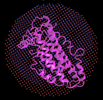
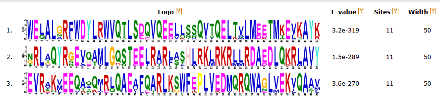
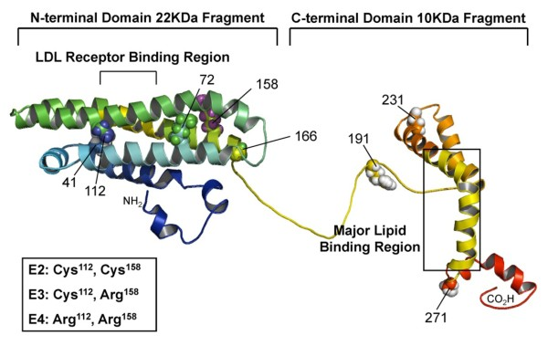

# Gene APOE

## Índice

- [Introduction](#introduction)
- [Alleles](#alleles)
- [Associated diseases](#associated-diseases)
    - [Alzheimer's disease](#aLzheimer's-disease)
    - [Cardiovascular Disease](#cardiovascular-disease)
    - [Lewy Body Dementia](#lewy-body-dementia)
    - [Others](#others)
- [Motifs](#motifs)
- [Domains](#domains)
- [Alignments](#alignments)
- [Phylogenetic Tree](#phylogenetic-tree)
- [Regulatory Elements](#regulatory-elements)
- [Research on APOE](#research-on-apoe)

### Introduction
The apolipoprotein E (APOE) gene is a critical player in lipid metabolism and a key genetic factor in the pathogenesis of various neurodegenerative diseases, particularly Alzheimer's disease (AD). Located on chromosome 19, the APOE gene encodes the apoE protein, which is essential for the normal catabolism of triglyceride-rich lipoprotein constituents. ApoE is a polymorphic protein with three major isoforms—ApoE2, ApoE3, and ApoE4—arising from three alleles (ε2, ε3, and ε4) at a single genetic locus.

[Link to NCBI 3D view of the protein](https://www.ncbi.nlm.nih.gov/Structure/icn3d/full.html?&mmdbid=92265&bu=0&showanno=1&source=full-feature) .

### Alleles

The APOE gene has three main alleles: APOE ε2, APOE ε3, and APOE ε4. These variants differ by specific amino acid substitutions, which can affect the function of the apolipoprotein E protein. Therefore, these alleles encode different forms of the apolipoprotein E protein, which is essential in lipid transport and distribution within the body. 

- **APOEɛ3:** Is the most prevalent allele, found in the majority of the population, and serves as the standard reference variant. 

- **APOEɛ2:** Although less common, has distinctive properties that can affect various metabolic pathways. 

- **APOEɛ4:** Is the least frequent but has notable implications for metabolic functions. The variations in these alleles influence how the body processes and transports lipids, impacting energy balance and the repair and maintenance of cellular structures. Each allele's presence can significantly shape an individual's metabolic profile and their body's efficiency in handling nutrients.

### Associated diseases
#### Alzheimer's disease

Alzheimer's disease is a degenerative brain disorder that causes dementia, which is a gradual loss of memory and functional ability. The mechanisms behind this complex disease are still being investigated, but there is a growing understanding that the apolipoprotein E (APOE) gene plays a significant role in susceptibility to Alzheimer's disease.

##### Influence of Alleles on Alzheimer's Disease

- **APOEε4:** Individuals who inherit one or two copies of the APOE ε4 allele have a significantly higher risk of developing the disease compared to those who do not possess it.
ApoE is involved in maintaining neuronal integrity, transporting cholesterol, and clearing toxic substances, such as beta-amyloid plaques, which are characteristic of Alzheimer's disease. However, the presence of the APOE ε4 allele may interfere with these functions in ways that increase susceptibility to neurodegeneration and plaque formation.

- **APOEε2:** Appears to provide some protection against the disease. Individuals who inherit one or two copies of this allele have a reduced risk of developing the disease.
The apoE produced by the ε2 allele seems to have protective properties against the formation of beta-amyloid plaques and may be associated with a more effective anti-inflammatory response in the brain.

- **APOEε3:** Is considered neutral in terms of risk for Alzheimer's disease.

#### Others:

- Cardiovascular Disease
- Lewy Body Dementia
- Familial Combined Hyperlipidemia
- Age-related Hearing Loss 
- Age-related Macular Degeneration

### Motifs 

**Note:** The discovered motifs in the analysis of the provided sequences are presented in the form of sequence logos, highlighting specific amino acid patterns that appear more frequently in aligned positions. Each motif represents a conserved sequence that may have significant functional or structural roles in the analyzed proteins.

**1º motif: WELALGRFWDYLRWVQTLSEQVQEELLSSQVTQELTALMDETMKELKAYK**
    
- This motif contains a mix of hydrophobic and hydrophilic residues, as well as charged residues. The presence of residues like L (leucine), W (tryptophan), and Y (tyrosine) suggests that this region could be part of an alpha-helix or a beta-sheet, which are common structures in binding domains.
- This motif may be involved in protein-protein interaction or receptor binding. 

**2º motif: NRLAQYRGEVQAMLGQSTEELRARLASHILRKRLLRDAEDLQKRLAVY**
    
- This motif also shows a mix of hydrophobic and hydrophilic residues, along with several positively (R, K) and negatively (E, D) charged residues. The high frequency of charged residues suggests that this motif might be involved in electrostatic interactions, potentially with nucleic acids or other proteins and may indicate a role in DNA or RNA binding, or in cellular signaling and gene expression regulation.

**3º motif: EVRAKVEEQAQQIRLQAEAFQARLKSWFEPLVEDMQWAGLVEKVQAAV**
    
- This motif contains several positive and negative charges, along with hydrophobic residues, that uggests a secondary structure such as alpha-helices or beta-sheets. Residues like W (tryptophan) and F (phenylalanine) indicate regions that might be involved in stabilizing the protein structure.
- This motif may play a role in protein-protein interaction or complex formation. The combination of charged and hydrophobic residues suggests a function in membrane anchoring or lipid interaction.

In terms of evolutionary conservation, the presence of the same motifs in the 11 species analyzed demonstrates strong conservation over time. This suggests that these motifs perform critical functions that have been preserved through evolution, indicating their biological importance.

[link to motifs in MEME ](https://meme-suite.org/meme//opal-jobs/appMEME_5.5.51716314449618-567205120/meme.html)

### Domains 
The APOE gene presents two domains: "PCSK9_C-CRD" and "NR_LBD".

##### NR_LBD Domain (N-terminal domain)
**Function:** In the NR_LBD domain, the members of the family include steroid receptors, thyroid hormone receptors, retinoid receptors, cholesterol by-products, and lipid receptors.

##### PCSK9_C-CRD Domain (C-terminal domain)
**Function:** This domain regulates hepatic receptors for low-density lipoproteins (LDL), very low-density lipoproteins (VLDL), and apoE2 receptors.

### Alignments

The alignment reveals conserved and variable regions in the amino acid sequences of these proteins:

    
**Conserved Region 'RDAEDLQ'**
- The conserved region "RDAEDLQ" in the APOE gene underscores its crucial role in maintaining the protein's structural integrity and functional capacity. Its preservation through evolutionary processes highlights its importance in the protein's biological functions, particularly in lipid metabolism and transport. Further research into this region could provide deeper insights into its specific roles and potential implications in disease mechanisms and therapeutic interventions.

**Non-Conserved Region 'KAYKKELEEQLGPVAEETRARLAKEVQAAQAR'**
- Non-conserved regions often indicate parts of the protein that can tolerate amino acid changes without significantly affecting the protein's overall function. This flexibility can be essential for adapting to different environmental conditions or functional demands.

[Clustal Omega aligment sequences](https://www.ebi.ac.uk/jdispatcher/msa/clustalo/summary?jobId=clustalo-I20240517-094117-0988-90699311-p1m)

## Phylogenetic Tree

This phylogenetic tree illustrates the evolutionary relationships between different species based on the APOE gene sequences or a related protein. Several species are represented, including primates such as Homo sapiens and Gorilla gorilla gorilla, non-primate mammals such as Tupaia glis and Lepus europaeus, and others like Castor canadensis and Trichechus manatus latirostris. The detailed analysis of this tree reveals crucial insights into phylogenetic relationships and the evolution of the APOE gene.

Based on the analysis of the phylogenetic tree, several conclusions can be drawn:

- *Homo sapiens* and *Gorilla gorilla gorilla* are closely related, reflecting the expected proximity between humans and gorillas. APOE sequences in *Homo sapiens* are most similar to those of *Gorilla gorilla gorilla*, as expected due to phylogenetic proximity.
- *Microcebus murinus* shows surprising proximity to humans and gorillas, suggesting a close relationship within primates. APOE proteins in *Microcebus murinus* are also close to those of humans and gorillas, reflecting the classification of lemurs as primates.
- *Tupaia glis* and *Lepus europaeus* are closely related, indicating a close phylogenetic relationship between these non-primate mammals.
- *Mustela putorius* furo and *Mustela lutreola* are presented as sister groups, as both are species of the *Mustela genus*.
- *Apodemus sylvaticus* and *Mus pahari* also form a group, indicating their close evolutionary relationship as rodents.
- *Castor canadensis* and *Trichechus manatus latirostris* separate earlier from other species, suggesting a greater evolutionary distance between them and the other listed groups.
- Proteins in rodent species, such as *Apodemus sylvaticus* and *Mus pahari*, are more closely related to each other than to other species, reflecting their close evolutionary relationship.
- *Trichechus manatus latirostris* and *Castor canadensis* have APOE sequences that diverge significantly from primates and rodents, reflecting their unique positions in the *mammalian* phylogenetic tree.

[iTOL phylogenetic_tree](https://itol.embl.de/tree/94132235184196761714329487)

### Regulatory Elements 

The expression of APOE is regulated by various regulatory elements that control when, where, and in what quantity the gene is expressed. In this context, the elements EH38E1957009, EH38E1957010, EH38E1957011, and EH38E1957012 play a fundamental role.

**EH38E1957009:** This regulatory element is located in the promoter region of the APOE gene. The promoter is essential for the initiation of transcription. It contains DNA sequences that allow the binding of transcription factors and RNA polymerase II, initiating the transcription process of the APOE gene.

**EH38E1957010:** This enhancer is situated near the APOE gene. This element increases the expression of the APOE gene, especially in response to specific factors present in certain tissues such as the liver and brain.

**EH38E1957011:** This enhancer is also located near the APOE gene. It acts by increasing the expression of APOE under specific conditions, facilitating the binding of transcription co-activators.

**EH38E1957012:** This is another enhancer close to the APOE gene. This regulatory element works in conjunction with the other enhancers to promote adequate levels of APOE expression in response to metabolic and cellular signals.

[Genome Browser regulatory elements ](https://genome.ucsc.edu/cgi-bin/hgTracks?db=hg38&lastVirtModeType=default&lastVirtModeExtraState=&virtModeType=default&virtMode=0&nonVirtPosition=&position=chr19%3A44905796%2D44909393&hgsid=2244147862_Zh2Dx2slwJn3oPDaNqx2iYfvxQvP)

### Research on APOE 
Machine Learning Predicts Conversion from Normal Aging to Mild Cognitive Impairment Using Medical History, APOE Genotype, and Neuropsychological Assessment

This study focused on identifying individuals at risk of developing mild cognitive impairment (MCI) using machine learning approaches. The aim was to assess whether these techniques could leverage longitudinal neuropsychological measures, medical data, and the APOEɛ4 genotype to predict MCI 1 to 2 years in advance. Moreover, the research involved 676 participants of whom 66 converted to MCI. Supervised machine learning algorithms were applied to predict this conversion. The results showed that the random forest algorithm predicted conversion with 97% accuracy (p = 0.0026) in the 1-2 year interval before diagnosis. The lowest memory measures from the 'Rey Auditory Verbal Learning Test' and 'Selective Reminding Test' were the strongest predictors. The study demonstrates the feasibility of using machine learning to identify individuals with a high likelihood of converting from normal cognition to MCI.

[machine learning APOE study ](https://pubmed.ncbi.nlm.nih.gov/38393898/)

